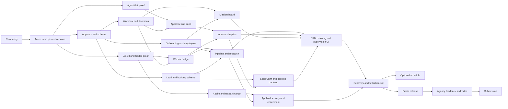

# OpenSquad executable build plan

Refined 13 September 2026. This is a build handoff, not a claim that the product
or its cloud integrations are implemented. Start with `pnpm plan next`.

## Product and approach

Build a supervised AI sales team for a small web/design agency: confirm a
campaign → discover up to five companies → research source-backed opportunities
→ enrich qualified contacts → prepare exact drafts → human approval → AgentMail
send → real reply → propose a booking → record the agreed meeting → track the
next sales action and eventual won/lost outcome. The Leads CRM at `/leads` is
the signed-in home: owners, statuses, evidence, conversations, notes and due
actions remain visible throughout this flow. Scout, Researcher and Outreach
are configurable employees. Supporting Mission Control at `/overview` shows
execution, required decisions and completed work; it is not the sales pipeline.

The user's latest direction explicitly includes **ASCII sandboxes and Codex
authentication for agent runs**. Therefore the selected architecture combines
Codex App Server in one ASCII Box per workspace with Convex Workflow for durable
orchestration. This resolves the conflict between the older sales architecture
(external runtime) and the later HTML blueprint (API inference by default).
Retain the blueprint's mission/decision UX and its rejection of a duplicate jobs
engine. Hosted Codex login must pass a real integration gate before it is claimed
to work. An API-funded alternative is a separate decision, never a silent switch.

Build narrow vertical slices and prove the expensive assumptions early. Begin
with app identity, isolated runtime login, one sourced result and a controlled
email round trip. Expand to five prospects after the boundaries work. Waiting
for approval must release the model slot and survive browser/runtime restarts.
One rejected or uncontactable prospect must not block approved siblings.
Booking is core: propose a configured booking link or explicit slots through an
exact-approved email, then let an authorized human record the actually agreed
time, timezone and confirmation basis. Reschedule, cancellation, completion and
no-show remain visible in CRM history. Calendar-provider synchronization is a
separate optional integration and must never be implied by a booking record.

## What exists

At baseline commit `988fb16`: Vite + React + TypeScript, pnpm 11.21.0, TanStack
Router, shadcn/Base UI, Hugeicons, Hexclave sign-in, Convex client/JWT config,
dashboard shell and date picker. `/squads`, `/settings` and `/overview` contain
placeholder product behavior. There is no domain schema, registered Convex
component, mission workflow, ASCII worker, email integration or verified public
deployment in the inspected source. Dependencies alone do not prove integrations.

Source inputs read: local `docs/OpenSquad-Architecture.md` and
`docs/mission-control-blueprint.html`, the code and the repository hackathon skill.
The user has an existing `.gitignore` change ignoring `docs`; it is preserved.
This `plan/` handoff is self-contained and trackable without those ignored files.

## Read and execute

| File | Purpose |
|---|---|
| [tasks.md](tasks.md) | Ordered work packages: exact deliverables, file boundaries, skills, commands, acceptance and handoff |
| [architecture.md](architecture.md) | App auth/roles, schema/indexes, backend contracts, state machines, worker and sending boundaries |
| [integrations.md](integrations.md) | ASCII/Codex lifecycle and auth, provider setup, credential destinations and feasibility gates |
| [verification.md](verification.md) | Manual acceptance scenarios and public demo/release checklist |
| [skills.md](skills.md) | Repository skill entrypoint, specialist routing and portable execution rules |
| [tasks.json](tasks.json) | Machine-readable dependencies, status, ownership and evidence |
| [worktrees.md](worktrees.md) | Parallel agents, worktree setup, ownership, isolated backends and integration |

```bash
pnpm plan check
pnpm plan status
pnpm plan next
pnpm plan show P03
```

Before installing dependencies these also work with `node scripts/plan.mjs`.
The helper validates the plan and prints ready task cards/prompts. **It does not
execute provider calls, build the application, publish, or automatically mark
work complete.** A human or coding agent executes the printed task using the
repository skill. For example:

> Use $opensquad-build to execute P02. Read its task card and specifications,
> work in the assigned worktree, complete its acceptance gate, and hand the
> branch and task evidence to the integrator for acceptance and log updates.
> Do not write tests.

The integrator sets a task to `in_progress` with its agent, branch and worktree
before dispatch. After review, integration and acceptance, the integrator sets it
to `done` with sanitized evidence in `tasks.json`. Use `blocked`
plus a specific blocker when access is missing; execute other ready work. Leave
stretch tasks pending or explicitly `skipped`. The validator requires completed
dependencies before a task is in progress or done, and evidence for completed
tasks. Every card declares its dependencies explicitly. It cannot certify that evidence
is true; the reviewer must inspect it.

## Scope and decisions

| Decision | Selected approach |
|---|---|
| Application stack | Keep Vite/React/TanStack Router/Hexclave; no Next.js or auth migration |
| Agent execution | One workspace-owned ASCII Box; Codex App Server; separate employee threads; one active model run per workspace |
| Orchestration | Convex Workflow checkpoints and events; a small lease ledger solely for external execution transport |
| First source | Apollo company discovery → Firecrawl website research → qualified Apollo contact enrichment |
| Other sources | YC and TrustMRR only after their own extraction gate; keep unavailable choices disabled with explanation |
| Research integration | Firecrawl component for backend-owned research; agent requests a bounded OpenSquad tool; no duplicate MCP crawl |
| Outbound mail | One AgentMail inbox per workspace; backend-only, version-bound send adapter; components own supported transport records |
| Human access | Owner/operator/viewer roles; owner alone manages model/provider connections and limits; see schema contract |
| Main navigation | Leads CRM, Shared inbox, Mission Control, Decisions, Employees, Settings; `/leads` becomes post-login home when its working route ships in P13; `/squads` redirects to Employees |
| CRM records | Keep `prospects` as the underlying lead table; add owner, sales stage, due next action and append-only `leadEvents`; no parallel leads database |
| Booking | Proposed link/slots, exact-approved email, human-confirmed meeting with time/timezone/basis, reschedule/cancel/completed/no-show; won/lost remains a separate explicit sales outcome |
| Documents | Research briefs/evidence in mission/prospect detail; no general document editor |
| Public hosting | Convex static hosting for Vite `dist`, with authenticated API/webhook routes preserved |
| Demo access | Public sanitized read-only tour; isolated opt-in execution with strict budgets and controlled recipients; no customer credentials in public tour |

Core completion means the controlled research → outreach → reply → booking flow
and CRM operations work, with applicable V01–V24 gates passing. Deferred:
universal agents, marketplace, arbitrary shell access, free-form agent chat,
third-party CRM synchronization, automatic calendar sync, individual employee
inboxes, unlimited concurrency, desktop streaming and autonomous negotiation.
P15 is optional: one recurring discovery schedule **or** a version-checked
follow-up. Do it only after the core acceptance gate, without delaying release.

## Dependencies and parallel ownership



After P01, three people/agents can own foundation (P02/P06), runtime (P03/P04),
and mail (P05). P04/P05 are provider feasibility probes; full authorization,
budgets, leases and approval behavior are accepted by their later owning cards.
Frontend P08/P12 can advance when foundation contracts land. P02 includes campaign
CRUD/source confirmation so P08 does not depend on the later execution pipeline.
P20 declares the §4.3 lead/booking/evidence tables once, so P21, P09, P11 and P19
write to one lead store instead of racing to define it. P21 owns every pipeline
behavior that does not call Apollo and P09 adds only the two Apollo-sourced
stages, so a deferred OAuth grant blocks one card rather than the release chain;
full acceptance in P14 still requires the real Apollo path. P19 can follow P11
alongside pipeline/board completion and must land before P13.
Task numbers are stable identifiers, not a numeric execution order.
Use one agent per task worktree and one integrator for shared contracts,
canonical task status and the build log. Dependency completion means the reviewed
change and its evidence are on the shared integration branch. Follow the
[parallel worktree runbook](worktrees.md) for setup, assignment, isolated Convex
deployments, handoff and merge order. Task cards define dependencies; the tracker
prints every ready task rather than imposing a single sequential build.

## Dependency gates and scope

Execute every ready task in parallel where its file ownership and development
resources are isolated. Advance when prerequisite changes are integrated and
acceptance evidence exists. There are no developer time budgets, effort estimates,
dated build phases or elapsed-time cutoffs.

If a provider gate fails, record the exact failure and supported recovery; keep
other ready agents working. Hosted Codex remains the selected runtime. A genuine
capability blocker requires a concrete product decision, not a change triggered
by an investigation timer. Optional P15 begins only after the core gate and can
proceed separately from release without becoming a release prerequisite.

No test files are to be written; use existing checks and manual evidence. This
planning assignment itself executes no account connection, paid resource creation,
email, publication or submission. During implementation, honor authorization
already present in the session. Prepare a concrete artifact or bounded external
probe before obtaining only genuinely missing account input or authorization.

## Event and release target

The official **Convex All Gas Hackathon** page requires a public repository,
root `hackathon.md`, an accessible `convex.site` or `chatgpt.site` application,
meaningful sponsor use, a video under three minutes and social sharing. The
published deadline is **22 September, 12 PM Pacific**: for 2026 that is
**19:00 UTC / 23 September 00:30 IST**. Recheck the page immediately before
release and submission. [Official event](https://www.convex.dev/hackathons/all-gas)

## Baseline verification

`pnpm lint` exits successfully with one pre-existing `react(set-state-in-effect)`
warning in `src/hooks/use-mobile.ts`. `pnpm build` passes with an existing
large-chunk advisory. P00 records the final handoff checks. No app integration
was exercised or claimed by creating the plan.
