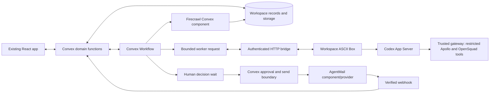

# OpenSquad implementation architecture

Status: execution specification; application behavior below is planned, not implemented.
Read alongside [the execution plan](README.md) and [integration protocols](integrations.md).
This document resolves domain, authorization, persistence and execution boundaries; provider installation, credentials and verified commands belong in `integrations.md`.

## 1. Decisions and scope

1. Retain Vite, React, TanStack Router, pnpm, Hexclave, shadcn/Base UI and the existing Hugeicons system.
2. Convex is the application backend, database, reactive subscription layer and storage service.
3. `@convex-dev/workflow` owns durable stage ordering, safe retries, event waits and continuation after human decisions.
4. ASCII Box plus Codex App Server is the primary employee runtime. One isolated Box belongs to one workspace; employees use separate Codex threads inside it.
5. Worker lease records transport bounded external execution requests. They do not form a second workflow engine, determine business-stage ordering or independently retry the campaign.
6. AgentMail owns email transport. Its component handles inbound storage/verified events; a narrow Convex-controlled REST action supplies the approved-send/idempotency boundary documented in `integrations.md`.
7. The Firecrawl Convex component supplies backend-owned website research with budget checks; Apollo through a trusted tool gateway supplies company/person search and qualified-contact enrichment. The initial route is Apollo discovery → Firecrawl research → Apollo contact enrichment.
8. YC and TrustMRR remain selectable only after their extraction and source-specific filter gates pass. Preserve their intended support without pretending they already work.
9. One workspace may have only one active Codex model run. Waiting for a person, workflow timer or provider callback does not consume a model slot.
10. Sales, lead search, scraping/research, outreach and CRM progression through booking are the core product. A mission coordinates work; a prospect is the lead/CRM entity, a run is an execution receipt, and a decision is a required human answer.
11. `/leads` is the default signed-in CRM home; `/overview` remains supporting Mission Control. Its board order is Backlog, Needs you, In flight, Done and never substitutes for sales stages.
12. Ship five researched leads, a traceable approved-send/reply conversation and a working booking-record flow. Booking links/proposed times use approved email; a human confirms actual meetings. Calendar-provider synchronization remains an optional integration gate.

The runtime recommendation in `docs/mission-control-blueprint.html` is superseded by the user's latest ASCII/Codex choice. Keep its mission/decision interaction model. Do not implement OpenClaw, Hermes, a second API server, a general plugin marketplace or an additional agent framework for the same runtime.

## 2. System and ownership

| Owner | Authoritative facts | Never delegated to it |
| --- | --- | --- |
| Hexclave | Human authentication and signed identity claims | OpenSquad business permissions derived from prompt text |
| Convex domain records | Membership, leads/CRM ownership and history, bookings, missions, evidence, drafts, decisions, approval, suppression, budgets | Long-lived shell processes |
| Workflow component | Workflow execution, step checkpoints, event waiting, retry state | An alternate `jobs` table reproducing this state machine |
| ASCII runtime | Isolated credential files, Codex process and temporary job files | Authoritative membership, approval or final email permission |
| Codex App Server | Employee thread context and bounded tool/model execution | Implicit access to every provider tool |
| AgentMail component | Inbound messages and verified/deduplicated provider event ingestion | Sales ownership, business approval or the final outbound dispatch boundary |
| OpenSquad send attempts/receipts | Approved-send intent, uncertainty/reconciliation and a projection of verified provider delivery events | Guessed delivery state or a second provider-message store |
| Firecrawl Convex component | Crawl/extraction storage, supported completion/recovery machinery | Unsupported assumptions about site completeness or workspace authorization |

Register Workflow, AgentMail and Firecrawl components in `convex/convex.config.ts` after verifying current package exports. Firecrawl requests run through authorized backend operations; do not configure a duplicate direct Firecrawl MCP route for employees. Codex owns employee conversations, so do not install `@convex-dev/agent` solely to duplicate their thread history.

## 3. Authentication and authorization

### 3.1 Human login

Keep `src/hexclave/client.ts`, `src/components/ConvexClientProvider.tsx` and `convex/auth.config.ts` as the starting integration. Inspect the installed `@hexclave/react` exports/types and actual authenticated Convex identity before modifying them. Existing login UI is not evidence that Convex receives usable identity claims.

- The browser supplies business arguments, never an authoritative `userId`, owner, role or external team identity.
- `ctx.auth.getUserIdentity()` supplies the verified identity. Map it to a stable issuer/subject or `tokenIdentifier` key according to the inspected Hexclave claims; never key membership by mutable display name or email.
- Validate authenticated versus anonymous/restricted claims according to the installed provider contract. If selected-team claims exist, verify their relationship to the workspace; do not invent a required team claim for a product using app-owned workspaces.
- App workspace selection is permitted as a selector; `requireWorkspaceMember` must independently resolve identity and active membership on every query/mutation/action entry point.
- Reuse the `@hexclave/react` Vite integration. Do not copy `@hexclave/next`, Next.js cookies, API routes or `convex/nextjs` helpers into this application.
- Authentication/configuration failures return explicit signed-out or connection-error UI. Do not fall back to a demo owner or a development token.
- Initial onboarding creates one workspace and owner membership transactionally and idempotently for the authenticated person. A separate membership invitation product is deferred.

| Role | Read workspace | Create/edit missions, campaigns, drafts | Approve/reject, takeover, pause a campaign | Manage members, runtime/provider login, sending policy |
| --- | --- | --- | --- | --- |
| `owner` | Yes | Yes | Yes | Yes |
| `operator` | Yes | Yes | Yes, within owner policy | No |
| `viewer` | Yes | No | No | No |

Use shared typed helpers, optionally `convex-helpers` custom function wrappers, to inject validated workspace context. Every referenced mission/prospect/campaign/conversation/draft/storage object must match that workspace. Authenticated status alone is insufficient. Do not expose broad table dumps or provider secrets to viewers.

Owners may change existing membership roles; prevent removal/demotion of the last owner. Additional members require a verified invitation/join mechanism before enabling that UI. Do not provide a public arbitrary-subject “join workspace” mutation as a shortcut.

### 3.2 Codex, provider and worker identities

- Codex connection authorizes model execution; it does not authenticate the app user. Only an owner can initiate/reconnect/disconnect the workspace's account.
- Credentials remain in that workspace's Box. Frontend responses contain connection status and a short-lived login challenge when the verified flow requires one, never saved tokens or raw credential files.
- Apollo/Firecrawl connections have their own capability and connection state. A successful Codex login does not imply either is connected.
- A worker bearer credential identifies exactly one runtime generation and workspace; store its hash, scopes, expiry and revocation state, not plaintext.
- Derive workspace from that credential at the bridge. Reject payload IDs outside that workspace even if the worker supplies a valid-looking ID.
- Worker scopes permit claiming its requests, heartbeats, bounded activity/results and authorized artifact upload. They never permit approvals, membership changes, policy changes or sending email.
- Do not put AgentMail send credentials or a Convex deployment/admin key in the Box. Do not share the builder's personal login across customer workspaces.

## 4. Schema contract

Notation: `Id<table>` means a Convex table ID, `?` means optional, `ms` means an integer UTC epoch-millisecond timestamp. Enum fields use literal unions. Numeric counters are finite nonnegative integers. Every custom customer-owned row has `workspaceId`; all human-written rows record the authenticated actor. `createdAt` and `updatedAt` are application timestamps where listed; Convex also supplies `_creationTime`.

Indexes below use explicit application timestamp fields, not an explicitly added `_creationTime` index column. An indexed lookup is not a uniqueness constraint: enforce uniqueness in the same mutation as insert/update. Query every growing collection through indexes with bounded `take` or cursor pagination.

This is the final schema contract, implemented incrementally by the owning task.
P02 introduces workspace/campaign foundations; P06 adds supervision, P07 runtime
transport, P09 research, P10/P11 correspondence and P19 CRM/booking. Do not make
all later tables or provider APIs a prerequisite for the first foundation gate.

### 4.1 Workspace and configuration tables

| Table | Required fields; optional fields marked `?` | Indexes / invariant |
| --- | --- | --- |
| `workspaces` | `name`, `ownerIdentityKey`, `timezone`, `automationState: active|paused`, `policyVersion`, `dailySendLimit`, `sendWindow: {weekdays,startMinute,endMinute}`, `demoMode`, `createdAt`, `updatedAt`; `inboxRef?`, `pauseReason?` | `by_ownerIdentityKey`, `by_inboxRef`; one unique assigned inbox/workspace; IANA timezone; conservative send policy explicitly confirmed in onboarding |
| `memberships` | `workspaceId`, `identityKey`, `role: owner|operator|viewer`, `status: active|revoked`, `createdAt`, `updatedAt` | `by_workspaceId_and_identityKey`, `by_identityKey_and_status`; unique workspace/identity pair |
| `businessProfiles` | `workspaceId`, `websiteUrl`, `offer`, `idealCustomer`, `tone`, `exclusions`, `version`, `updatedAt`, `updatedBy` | `by_workspaceId`; one current profile/workspace; meaningful edits increment version |
| `employees` | `workspaceId`, `template: scout|researcher|outreach`, `name`, `instructions`, `instructionVersion`, `enabled`, `allowedCapabilities`, `updatedAt` | `by_workspaceId_and_template`; one of each template initially; intersect user preference with enforced host policy |
| `campaigns` | `workspaceId`, `title`, `brief`, `briefVersion`, `sourcePlan`, `leadLimit`, `enrichmentLimit`, `status: draft|active|paused|completed`, `createdBy`, `createdAt`, `updatedAt` | `by_workspaceId_and_status`; `leadLimit` 1–5 for MVP; source plan has confirmed typed filters, budgets and confirmation actor/time |

`sourcePlan` is a bounded list of `apollo|yc|trustmrr` configurations with provider-specific typed filters. Store the original instruction separately from the confirmed interpretation. Include location/category filters where supported, selected YC batch where applicable, and explicit metric name/currency/period for TrustMRR revenue bounds. Unsupported filters cause a decision or validation error, not silently broadened searches.

### 4.2 Work and supervision tables

| Table | Required fields; optional fields marked `?` | Indexes / invariant |
| --- | --- | --- |
| `missions` | `workspaceId`, `campaignId`, `kind: sales_campaign|reply|follow_up`, `title`, `state`, `boardColumn`, `version`, `inputSnapshot`, `priority: normal|high`, `assignedEmployeeId`, `progressSummary`, `requiredDecisionCount`, `visibility: visible|archived`, `createdBy`, `createdAt`, `updatedAt`; `workflowId?`, `parentMissionId?`, `completedAt?`, `failure?` | `by_workspaceId_and_visibility_and_boardColumn_and_updatedAt`, `by_workspaceId_and_campaignId_and_visibility_and_boardColumn_and_updatedAt`; board fields updated only by validated transitions |
| `missionProspects` | `workspaceId`, `missionId`, `prospectId`, `generation`, `createdAt`; `childWorkflowId?`, `completionEventId?`, `outcome?`, `outcomeReason?`, `completedAt?` | `by_missionId_and_prospectId`, `by_prospectId`, `by_childWorkflowId`; unique mission/prospect pair; validates both parents; stable child start key prevents duplicate child workflows |
| `runs` | `workspaceId`, `missionId`, `employeeId`, `stage`, `generation`, `state: pending|running|succeeded|failed|cancelled|uncertain`, `inputVersion`, `inputSummary`, `createdAt`; `startedAt?`, `endedAt?`, `sessionId?`, `outputRefs?`, `usage?`, `error?` | `by_missionId_and_createdAt`, `by_workspaceId_and_state`, `by_employeeId_and_state`; execution receipts, not stage orchestration |
| `decisions` | `workspaceId`, `missionId`, `kind: draft_approval|missing_information|connection_required|delivery_uncertain`, `state: open|resolved|superseded|cancelled`, `version`, `required`, `reason`, `createdAt`, `updatedAt`; `draftId?`, `sendAttemptId?`, `requestedFields?`, `approvalId?`, `answer?`, `resolvedBy?`, `resolvedAt?` | `by_workspaceId_and_state_and_createdAt`, `by_missionId_and_state`, `by_draftId`; one open required decision per semantic ask; approval truth is the referenced approval record |
| `missionComments` | `workspaceId`, `missionId`, `authorIdentityKey`, `body`, `createdAt`; `acknowledgedByRunId?` | `by_missionId_and_createdAt`; comments cannot resolve an approval decision |
| `activityEvents` | `workspaceId`, `missionId`, `kind`, `summary`, `actor`, `createdAt`, `dedupeKey`; `runId?`, `prospectId?`, `conversationId?`, `artifactId?` | `by_workspaceId_and_createdAt`, `by_missionId_and_createdAt`, `by_workspaceId_and_dedupeKey`; persist meaningful receipts, no raw tokens or secrets |

Mission states: `queued|active|waiting_for_user|waiting_for_runtime|paused|failed|completed|cancelled`. Keep mission version separate from run generation and draft revision. A model-run failure may be retried by Workflow while its mission is still active; a completed model run does not complete an unfinished mission.

`inputSnapshot` contains the confirmed campaign brief/source plan, business-profile version and relevant text, employee instruction versions, policy version and requested outcome. Bound it to 64 KiB. A future edit applies to newly dispatched work only after explicit version reconciliation; do not mutate the historical run input that explains already-produced evidence.

Each decision and worker request additionally carries `targetWorkflowId`,
`continuationEventId` and `workflowGeneration` using the installed component's
serializable ID types. The authenticated backend assigns them when dispatching,
never trusts them from the result payload, and signals that exact child/parent
only once. A human decision's record version is separate from this generation.

### 4.3 Sales, research and correspondence tables

| Table | Required fields; optional fields marked `?` | Indexes / invariant |
| --- | --- | --- |
| `prospects` | `workspaceId`, `campaignId`, `companyName`, `canonicalDomain`, `sourceRefs`, `qualification: pending|qualified|rejected|needs_review`, `fitReason`, `salesStage`, `ownerIdentityKey`, `version`, `createdAt`, `updatedAt`; `contact?`, `nextAction?`, `nextActionDueAt?`, `lastContactedAt?`, `lastReplyAt?`, `stageReason?` | `by_workspaceId_and_salesStage_and_updatedAt`, `by_workspaceId_and_campaignId_and_salesStage`, `by_workspaceId_and_ownerIdentityKey_and_nextActionDueAt`, `by_workspaceId_and_nextActionDueAt`, `by_workspaceId_and_campaignId_and_canonicalDomain`; one campaign/domain; preserve cross-source provenance |
| `leadEvents` | `workspaceId`, `prospectId`, `kind`, `actor`, `summary`, `createdAt`, `operationKey`; `fromStage?`, `toStage?`, `bookingId?`, `missionId?`, `runId?`, `details?` | `by_prospectId_and_createdAt`, `by_workspaceId_and_operationKey`; append-only CRM status/owner/note/next-action/booking history; actor comes from auth or internal workflow |
| `bookings` | `workspaceId`, `prospectId`, `ownerIdentityKey`, `state: proposed|confirmed|cancelled|completed|no_show`, `version`, `proposal`, `createdAt`, `updatedAt`; `conversationId?`, `missionId?`, `draftId?`, `startsAt?`, `endsAt?`, `timezone?`, `confirmationSource?`, `confirmedBy?`, `confirmedAt?`, `externalEventRef?`, `confirmationNote?`, `cancellationReason?` | `by_prospectId_and_createdAt`, `by_workspaceId_and_state_and_startsAt`, `by_workspaceId_and_ownerIdentityKey_and_startsAt`; one active proposal/confirmed meeting per lead initially; times required for confirmed/completed/no-show |
| `evidence` | `workspaceId`, `prospectId`, `runId`, `sourceUrl`, `retrievedAt`, `excerpt`, `observation`, `confidence: supported|hypothesis|unknown`, `createdAt`; `artifactId?` | `by_prospectId_and_createdAt`; bounded excerpts with full output in storage when needed |
| `conversations` | `workspaceId`, `inboxRef`, `employeeId`, `state: open|closed|unassigned`, `humanTakeover`, `contextVersion`, `unreadCount`, `createdAt`, `updatedAt`; `prospectId?`, `providerThreadRef?`, `currentDraftId?`, `lastInboundMessageRef?`, `lastInboundAt?`, `lastMessageAt?` | `by_workspaceId_and_state_and_lastMessageAt`, `by_workspaceId_and_humanTakeover_and_lastMessageAt`, `by_inboxRef_and_providerThreadRef`, `by_prospectId`; unique assigned inbox/provider-thread mapping |
| `drafts` | `workspaceId`, `conversationId`, `inboxRef`, `missionId`, `revision`, `recipient`, `normalizedRecipient`, `subject`, `body`, `payloadHash`, `basedOnContextVersion`, `campaignBriefVersion`, `policyVersion`, `evidenceIds`, `createdBy`, `createdAt`; `replyToMessageRef?`, `supersededAt?` | `by_conversationId_and_revision`, `by_missionId`; immutable content per row; unique conversation/revision; one current draft pointer |
| `approvals` | `workspaceId`, `draftId`, `draftRevision`, `payloadHash`, `normalizedRecipient`, `contextVersion`, `decision: approved|rejected`, `approverIdentityKey`, `createdAt`, `requestId` | `by_draftId`, `by_workspaceId_and_requestId`; immutable decision for exact content; later changes supersede applicability, not historical facts |
| `sendAttempts` | `workspaceId`, `draftId`, `approvalId`, `conversationId`, `inboxRef`, `operationKey`, `endpointOperation: send|reply`, `providerIdempotencyKey`, `state: reserved|requesting|acknowledged|uncertain|definitively_failed|cancelled`, `payloadHash`, `createdAt`, `updatedAt`; `providerMessageRef?`, `providerThreadRef?`, `providerDeliveryFacts?`, `replacementDecisionId?`, `requestStartedAt?`, `error?`, `reconciledAt?` | `by_draftId`, `by_conversationId_and_state`, `by_replacementDecisionId`, `by_workspaceId_and_state_and_updatedAt`, `by_workspaceId_and_operationKey`, `by_providerMessageRef`; one logical send per draft; delivery facts only from verified events |
| `emailEventReceipts` | `workspaceId`, `inboxRef`, `providerEventId`, `applicationKey`, `providerMessageRef`, `eventType`, `receivedAt`, `handlingState: pending|handled|failed`, `providerFacts`; `providerThreadRef?`, `handledAt?`, `error?` | `by_providerEventId`, `by_workspaceId_and_applicationKey`, `by_providerMessageRef`, `by_handlingState_and_receivedAt`; unique provider event and application handling key; bounded replay/reconciliation record |
| `suppressions` | `workspaceId`, `kind: email|domain`, `normalizedValue`, `reason: unsubscribe|manual|bounce|provider`, `createdAt`; `sourceConversationId?` | `by_workspaceId_and_kind_and_normalizedValue`; unique key; domain suppression is explicit, not inferred from one person's unsubscribe |
| `artifacts` | `workspaceId`, `missionId`, `kind: research_brief|crawl|audit|attachment`, `storageId`, `mimeType`, `byteSize`, `contentDigest`, `operationKey`, `createdAt`; `prospectId?`, `runId?` | `by_missionId_and_createdAt`, `by_prospectId`, `by_workspaceId_and_operationKey`; store `Id<_storage>` rather than transient download URLs; deduplicate uploads |

`sourceRefs` is bounded to 10 distinct source references per prospect: source, profile URL, provider record ID where available, retrieved time, and observed metric metadata. Normalize domains with a real URL/public-suffix-aware approach; preserve meaningful subdomains when they identify a different business. Never merge companies by display name alone.

MVP `contact` is one selected business person: provider/person reference, name, role, email if available, provider email status, retrieved time and selection reason. Preserve unknown/unverified states; never manufacture an address. Keep provider status distinct from OpenSquad's send eligibility.

`prospects` is the backend table name; user-facing navigation and copy say Leads/CRM. `salesStage` is `discovered|researched|qualified|contact_needed|draft_ready|contacted|replied|booking_proposed|booked|won|lost`. Qualification and contact availability remain explicit orthogonal facts, so a missing email does not erase fit evidence. A later scrape refresh must not move a contacted/booked lead back to discovered. Human stage corrections require a reason and append a `leadEvents` entry; preserve the previous value.

`nextAction` is a bounded description plus action kind; `nextActionDueAt` is an explicit UTC due time derived from the selected timezone. Owners/assignees must be active workspace members. CRM views support pipeline mode (stage, optionally campaign) and due-action mode (due range, optionally owner) through their indexes, with pagination and a clear unscheduled state. Add the corresponding compound index before enabling additional combined filters; never post-filter a truncated page. Notes are lead events, not fake customer messages.

P19 adds `prospects.search_company_name` with `searchField: companyName` and
`filterFields: [workspaceId, salesStage, campaignId, ownerIdentityKey]`. The
`search({text,stage?,campaignId?,owner?,cursor,limit})` query always filters by the
authorized workspace and applies selected equality filters inside `withSearchIndex`.
Return relevance-ordered cursor pages with the ordinary 25/50 row limits. Empty
text returns to the normal list. Search mode does not combine due ranges or date
sorting; retain due-action mode separately and reset cursors when filters change.
The UI labels this Company name search; domain/body search is outside this slice.
[Convex text search](https://docs.convex.dev/search/text-search)

`bookings.proposal` is a discriminated union: `{kind: booking_link,url}` or `{kind: slots,timezone,slots:[{startsAt,endsAt}]}` with at most three future valid intervals. A proposed booking has no implied confirmation. For human-confirmed meetings require start/end, IANA timezone, `confirmationSource: manual`, authenticated confirmer/time and a short basis such as “prospect confirmed by reply”; save provider event references only when actually available. `confirmationSource: provider` is unavailable until a validated calendar connector verifies the event.

Add `bookings.by_prospectId_and_state` for transactional checks that at most one
proposed/confirmed booking is active. Booking invitation drafts carry optional
`bookingId` and `bookingVersion`; validate them again on approval and dispatch.
Only acceptance of that linked exact draft can advance its lead to
`booking_proposed`. Reschedule invalidates obsolete proposal drafts/approvals.
Cancellation/no-show records its reason and explicit next action; if no active
booking remains, move a non-won/lost lead to `replied` when an actual reply exists,
otherwise `contacted` after accepted mail, otherwise the last supported earlier
stage. Do not leave a cancelled-only lead misleadingly Booked.

Do not create a duplicate custom `messages` table. Authorize inbound component queries through workspace conversation/inbox references; compose outgoing history from immutable drafts and send attempts. `emailEventReceipts` supplies application replay and early-event reconciliation because the app-owned sender does not create a component outbound row. Use `incoming:<inbox>:<message>` as the inbound application key so a second event ID for one message cannot start a second reply mission. Delivery receipts retain only necessary verified facts and never another copy of full message bodies. Keep durable approved content beyond component cleanup periods.

### 4.4 Runtime and usage tables

| Table | Required fields; optional fields marked `?` | Indexes / invariant |
| --- | --- | --- |
| `runtimeConnections` | `workspaceId`, `generation`, `state: disconnected|provisioning|connecting|ready|stopping|stopped|error`, `createdAt`, `updatedAt`; `boxRef?`, `codexAccountSummary?`, `lastHeartbeatAt?`, `error?` | `by_workspaceId`; one active runtime record/workspace; owner-safe summaries only |
| `runtimeLifecycleOperations` | `workspaceId`, `runtimeConnectionId`, `runtimeGeneration`, `operation: create|resume|extend_ttl|stop|delete`, `operationKey`, `requestFingerprint`, `requestConfig`, `state: pending|accepted|uncertain|completed|failed`, `createdAt`, `updatedAt`; `boxRef?`, `providerOperationRef?`, `error?` | `by_runtimeConnectionId_and_createdAt`, `by_workspaceId_and_operationKey`; exact replay metadata, not a scheduler; requestConfig contains neutral settings and secure injection references, no raw credentials |
| `providerConnections` | `workspaceId`, `provider: codex|apollo|firecrawl|agentmail`, `state: disconnected|connecting|ready|expired|error`, `capabilities`, `updatedAt`; `runtimeConnectionId?`, `remoteReference?`, `verifiedAt?`, `error?` | `by_workspaceId_and_provider`; no plaintext credentials; only verified capabilities become available |
| `workerCredentials` | `workspaceId`, `runtimeConnectionId`, `runtimeGeneration`, `credentialHash`, `scopes`, `expiresAt`, `state: active|revoked`, `createdAt` | `by_credentialHash`, `by_runtimeConnectionId_and_state`; unique credential hash; server-only reads |
| `runtimeControlRequests` | `workspaceId`, `runtimeConnectionId`, `runtimeGeneration`, `requestId`, `command: inspect_account|start_login|cancel_login|logout|interrupt_turn`, `state: pending|claimed|completed|failed|expired`, `requestedBy`, `expiresAt`, `createdAt`; `loginId?`, `turnId?`, `safeResult?` | `by_runtimeConnectionId_and_state`, `by_workspaceId_and_requestId`; owner-generated commands only; never arbitrary shell text; claim/result generation checks |
| `runtimeLoginChallenges` | `workspaceId`, `runtimeConnectionId`, `runtimeGeneration`, `controlRequestId`, `verificationUrl`, `userCode`, `expiresAt`, `createdAt` | `by_runtimeConnectionId`, `by_expiresAt`; temporary owner-only challenge, absent from general queries/logs; delete on completion/cancel/expiry; provider URL allowlist validation |
| `agentSessions` | `workspaceId`, `employeeId`, `scopeKey`, `runtimeConnectionId`, `runtimeGeneration`, `codexThreadRef`, `createdAt`, `updatedAt` | `by_workspaceId_and_employeeId_and_scopeKey`; scope is campaign or prospect; saved thread IDs alone do not replace durable business context |
| `workerRequests` | `workspaceId`, `runtimeConnectionId`, `runtimeGeneration`, `missionId`, `runId`, `stepKey`, `generation`, `state: pending|leased|running|succeeded|failed|cancelled|uncertain`, `inputRef`, `outputSchemaVersion`, `createdAt`, `updatedAt`; `leaseHash?`, `leaseExpiresAt?`, `lastHeartbeatAt?`, `resultRef?`, `resultDigest?`, `error?` | `by_workspaceId_and_state_and_createdAt`, `by_state_and_leaseExpiresAt`, `by_runId`, `by_missionId_and_stepKey_and_generation`; request transport only |
| `workspaceExecutionSlots` | `workspaceId`, `generation`, `state: idle|held|uncertain`, `updatedAt`; `workerRequestId?`, `runId?`, `leaseExpiresAt?` | `by_workspaceId`; one transactional active model slot; uncertain execution does not free it automatically |
| `usageBuckets` | `workspaceId`, `scopeKey`, `metric: sends|apollo_enrichments|model_runs|research_pages|research_searches`, `periodKey`, `limit`, `reserved`, `committed`, `uncertain`, `updatedAt` | `by_workspaceId_and_scopeKey_and_metric_and_periodKey`; unique bucket; period is local date for sends, campaign lifetime for enrichment |
| `usageReservations` | `workspaceId`, `bucketId`, `operationKey`, `quantity`, `state: reserved|committed|released|uncertain`, `createdAt`, `updatedAt`; `providerReference?` | `by_workspaceId_and_operationKey_and_bucketId`, `by_bucketId_and_state`; one debit lifecycle per logical operation/bucket |
| `providerOperations` | `workspaceId`, `provider: apollo|firecrawl`, `operationKey`, `missionId`, `prospectId?`, `runId?`, `targetWorkflowId`, `continuationEventId`, `workflowGeneration`, `requestDigest`, `reservationIds`, `state: requested|accepted|completed|uncertain|failed`, `createdAt`, `updatedAt`; `componentRequestRef?`, `resultRef?`, `resultDigest?`, `error?` | `by_workspaceId_and_provider_and_operationKey`, `by_provider_and_componentRequestRef`; tool invocation dedupe, ownership and callback correlation only; Firecrawl component remains crawl-state authority |

Store JSON input/output snapshots as small validated data or private storage references; cap worker input at 256 KiB and structured output at 128 KiB initially. The precise provider SDK objects do not become application validators. Own stable versioned result shapes instead.

Runtime connections also store `workerVersion?`, `protocolVersion?`,
`currentCodexTurnRef?` and `currentRunId?`. Runtime-level liveness is distinct
from a leased model request; an idle/login worker must be able to report health.
For ambiguous ASCII creation, recover with the same saved request body/key and
generation-scoped secret injection references; do not rotate injected credentials
until that create is reconciled, or the replayed body will differ.

### 4.5 Employee output contracts

Every result has `schemaVersion: 1`, an operation discriminator and a scoped request/run reference checked against the lease. Validate these shapes in `convex/lib/validators.ts` and share equivalent generated/typed contracts with the worker; reject unknown fields that imply side effects or permissions.

| Operation | Accepted business payload | Mandatory checks |
| --- | --- | --- |
| `discover` | Up to five `{companyName,websiteUrl,sourceRefs,fitReason}` entries plus rejected-source summaries | Selected/confirmed sources only; public canonical domains; actual source reference required; no invented metrics |
| `research` | One `prospectId`, concise brief, observations `{sourceUrl,retrievedAt,excerpt,observation,confidence}` and `qualification`/reason | Prospect was assigned; at most 12 observations and 2,000 characters per excerpt; hypotheses labeled |
| `contact` | One `prospectId`, selected provider person reference, role/name, optional email, provider status, retrieval time and selection reason | Qualified domain match; authorized enrichment receipt/reservation; email is provider-returned rather than guessed |
| `draft` | One `conversationId`, exact recipient/subject/body, evidence IDs, proposed next action and originating context version | Assigned prospect/contact, current version, approved capability, evidence same workspace/prospect; maximum 200-character subject and 12,000-character body |
| `classify_reply` | One conversation/inbound-message reference, classification enum, concise rationale and proposed next action; optional draft payload | Inbound message belongs to assigned conversation and version; unsubscribe/takeover policy already enforced independently |

Business timestamps that affect permission/lease/accounting are set by the backend. A worker's source retrieval timestamp is evidence metadata, not authorization. Schema validation failure records a bounded error and leaves existing business records unchanged.

Optional `followUps` is introduced only after the core gate: workspace, conversation, mission, originating context version, due UTC time, timezone, state `scheduled|cancelled|started|completed`, schedule version and scheduled-function reference; index by workspace/state/due time and conversation/state. Recurring campaign definitions are a later extension, not fields that pretend a schedule already ran.

## 5. Backend modules and callable contracts

These are proposed OpenSquad function names, not existing exports or provider methods. Implement object-form Convex functions with `args` and `returns` validators, generated function references and typed literal unions. Queries/mutations remain in the default runtime; Node-dependent SDK operations live in action-only modules where required.

| Planned module | Public entry points and behavior | Internal responsibility |
| --- | --- | --- |
| `convex/lib/auth.ts` | No public exports | Identity, membership/role, same-workspace parent/reference validation |
| `convex/workspaces.ts` | `bootstrap({requestId})`, `getCurrent`, `updateProfile({expectedVersion,...})`, `setAutomationState`, `setSendingPolicy({expectedPolicyVersion,...})` | Idempotent owner setup, default employees, policy versioning |
| `convex/campaigns.ts` | `create`, `confirmSourcePlan({campaignId,expectedBriefVersion,...})`, `get`, `list`, `setState` | Normalize/cap source criteria; only confirmed plan may execute |
| `convex/missions.ts` | `create({campaignId,requestId,kind,title})`, `get`, `listBoard({campaignId?,column,cursor,limit})`, `pause`, `resume`, `cancel`, `archive`, `restore` | Transactional transitions; start/signal Workflow using installed component API |
| `convex/decisions.ts` | `listOpen`, `get`, `resolve({decisionId,expectedVersion,requestId,answer})` | Validate exact ask; persist approval/answer and one durable continuation signal |
| `convex/drafts.ts` | `get`, `revise({draftId,expectedRevision,recipient,subject,body,requestId})` | New immutable draft revision; invalidate current pending decision and create fresh one |
| `convex/prospects.ts` | `list({campaignId?,stage?,owner?,dueRange?,cursor,limit})`, `search({text,stage?,campaignId?,owner?,cursor,limit})`, `getDetail`, `updateStage({prospectId,expectedVersion,stage,reason,requestId})`, `assign({prospectId,expectedVersion,membershipId,requestId})`, `setNextAction({prospectId,expectedVersion,action,dueAt?,requestId})`, `addNote({prospectId,body,requestId})` | Lead CRUD/CRM progression, indexed pipeline queries, domain dedupe, versioned research/contact changes and append-only lead history |
| `convex/bookings.ts` | `list`, `get`, `propose({prospectId,expectedLeadVersion,proposal,requestId})`, `confirm({bookingId,expectedVersion,startsAt,endsAt,timezone,confirmationNote,externalEventRef?,requestId})`, `reschedule({bookingId,expectedVersion,startsAt,endsAt,timezone,reason,requestId})`, `cancel({bookingId,expectedVersion,reason,requestId})`, `recordOutcome({bookingId,expectedVersion,outcome,requestId})` | Operator-authorized manual booking records; approved proposal drafts; stage/next-action/history updates in the same mutation |
| `convex/conversations.ts` | `list`, `get`, `setTakeover({conversationId,expectedContextVersion,enabled})`, `associateProspect({conversationId,expectedContextVersion,prospectId,requestId})`, `assignEmployee`, `close`, `markRead` | Authorize message component access; owner/operator association validates same-workspace lead/campaign, records actor and advances context; association keeps takeover enabled |
| `convex/employees.ts` | `list`, `update({employeeId,expectedInstructionVersion,...})` | Intersect editable tools with enforced capability policy; status comes from actual run |
| `convex/runtimeConnections.ts` | Owner-only `connect`, `getStatus`, `reconnect`, `disconnect` | Provisioning actions, auth-status updates, credential rotation and runtime generation |
| `convex/artifacts.ts` | `getDownload({artifactId})` | Authorize private storage; validate uploads/metadata before linking |
| `convex/activity.ts` | `list({missionId?,from?,to?,cursor,limit})`, `listRuns({missionId,cursor,limit})` | Bounded feed/receipt projection; no provider token or raw reasoning exposure |
| `convex/workflows.ts` | None directly | Campaign/reply workflows, component events, terminal callbacks, cancellation/recovery policy |
| `convex/workerBridge.ts` | None directly | Credential validation, claim/heartbeat/result application, slot and lease checks |
| `convex/research.ts` | None directly | Budgeted Firecrawl component requests, completion callbacks, scoped page/result reads and concise evidence projection |
| `convex/usage.ts` | Owner/operator-safe summary only | Atomic reservations, settlement, local send-day calculation and exhaustion |
| `convex/sending.ts` | None directly | Preflight, durable send intent, AgentMail call, definitive/uncertain reconciliation |
| `convex/emailEvents.ts` | None directly | Verified provider-event application, mapping, suppression and reply Workflow dispatch |

Every mutation changing a versioned record accepts the expected version; stale versions return `CONFLICT` with the new readable state. Side-effect-creating commands accept an idempotency key. Keep semantic uniqueness on mission creation, decisions and send records; where a command needs a general request receipt, introduce a small indexed receipt store rather than claiming arbitrary retries are automatically idempotent.

`workspaces.update` requires `expectedPolicyVersion` when changing timezone,
because timezone determines the sending window and local-day budget. It bumps
`policyVersion` in the same transaction. Name-only edits and an unchanged
timezone preserve the policy version.

Queries return DTOs containing only UI fields. Default 25 rows, hard maximum 50; board queries page each column and return explicit “more” information. Do not hide old active missions by applying the Overview date filter to the board. Use date ranges only on activity and run history. Avoid exact unlimited counters; expose bounded counts with “50+”, or add maintained counters when required.

## 6. Mission and workflow behavior

| Mission state | Board column | Meaning / allowed next steps |
| --- | --- | --- |
| `queued` | Backlog | Confirmed and ready; Workflow may dispatch when runtime/capacity permits |
| `active` | In flight | Workflow owns current work, including a legitimate short provider/timer wait |
| `waiting_for_user` | Needs you | Required open decision; no employee model slot remains held |
| `waiting_for_runtime` | Needs you | Reconnect/capacity uncertainty requires attention; show a connection/error badge, not “review draft” |
| `paused` | Backlog | Explicit pause badge; resume only through authorized mutation |
| `failed` | Needs you | Terminal technical error and explicit safe retry/recovery action |
| `completed` | Done | Promised mission deliverables exist; record evidence and completion time |
| `cancelled` | Backlog | Explicit cancelled badge; can archive; never count as a successful completion |

Archive is visibility, not execution success. Do not archive active/waiting work without first cancelling or completing it. Defer Trash and irreversible deletion. Cards cannot be dragged to manufacture state transitions. `requiredDecisionCount > 0` places actionable work in Needs you; after the last required decision resolves, Workflow rechecks pause/cancel/current-input versions before continuing.

### 6.1 Initial sales mission

1. `missions.create` validates role, active campaign, confirmed source plan, requested scope, duplicate request and prerequisites; saves an input snapshot and starts one Workflow.
2. Workflow creates Scout run/request for discovery with maximum five companies and source rules; waits durably for its correlated external result.
3. Backend validates domains/source records and stores prospects plus mission links transactionally. Invalid results are rejected, with bounded Workflow-owned retry or a visible failure.
4. For each selected prospect, Workflow starts a bounded Firecrawl component request for its homepage and up to two relevant public pages, waits durably for completion without a model slot, and stores/references the authorized result. Then dispatch a Researcher Codex run to synthesize source-backed evidence/brief and qualification. Serialize external model work across this and other missions by the workspace slot.
5. Qualified prospects with no reusable valid contact reserve Apollo enrichment capacity. Scout chooses a relevant person and requests available contact detail through the controlled capability. Missing contacts become `contact_needed` with a clear next action.
6. Outreach receives persisted approved context, evidence and selected contact, then proposes an immutable draft. Backend validates the recipient/provenance and creates a required draft-approval decision.
7. Workflow waits for the decision event without holding an action or worker slot. Rejection/requested changes either cancels that send or creates a fresh drafting run and decision; old approval never applies to the revision.
8. Approval wakes the workflow; the sending boundary performs fresh checks and sends eligible messages. One unresolved decision may keep the mission in Needs you while other independent non-model results finish.
9. Complete this mission when the requested five-prospect research outcome and each selected outreach item's explicit terminal outcome exist: approved send acknowledged, intentionally rejected, or contact needed with next action. Do not wait forever for prospects to reply.
10. An incoming reply starts a separate `reply` mission linked to the original prospect/conversation. Its promised outcome is classification plus an appropriate response draft or explicit human action; it does not claim a booked meeting.

11. For an interested reply, prepare a booking-link or proposed-time response under the same exact-draft approval boundary. Sending the proposal advances the lead to `booking_proposed`; generation alone does not establish outreach or a confirmed appointment.
12. A permitted human records the actual confirmed meeting, including time/timezone and its confirmation basis. CRM then advances to `booked`, links the booking and sets the next action. Won/lost remain explicit business outcomes, never inferred from email sending or booking alone.

Start all selected prospect child workflows (maximum five) before waiting for their results. Steps 4–8 run per child: an open decision suspends only that prospect. The parent aggregates explicit child outcomes; a single pending approval never prevents another child from producing a draft or sending its approved message. The shared workspace slot serializes model turns across the children, not entire child workflows. Keep durable per-child references and completion events so a parent restart cannot start duplicates. Prompt/scoped input contains an explicit deadline, allowed operations, result schema and tool count. Persist completed outputs before the next stage. Later stage retries do not repeat successful discovery/research or repeat paid enrichment without a fresh authorized reservation.

An employee-facing OpenSquad research tool reads only the prospect's authorized component results and may propose additional allowed URLs. A missing durable crawl returns an explicit pending/requested result and hands control back to Workflow, which owns dispatch and continuation; do not hold an unbounded Codex turn or Convex action waiting on crawling. Store only crawl ownership/component references and application evidence, not a second crawl job engine.

### 6.2 Workflow continuation and failure

- Use the installed Workflow component's durable event API for worker completions and human decisions; verify exact event creation/sending signatures in `integrations.md` before writing imports or method calls.
- Correlate each event to workflow ID, semantic step/decision ID and generation/version. Save resolution and schedule/send its continuation through a transactionally durable supported path; no unrecorded “write succeeded, signal forgotten” gap.
- Receiving duplicate callbacks or human-resolution requests returns the existing outcome. A stale event never advances the current workflow generation.
- Retry read-only research within explicit attempt/time budgets. Reserve billable provider operations independently and settle them before deciding a retry is safe.
- Disable blind automatic retry for email submission and provider actions whose outcome could be uncertain. A failed provider HTTP response is not necessarily proof that no side effect happened.
- Pause stops new stage dispatch. Cancel marks pending requests obsolete and requests interruption of a running Codex turn; release the slot only after termination/completion is known.
- Sweep expired transport leases and missing heartbeats with bounded indexed queries. The sweep flags/reports the event to Workflow; it does not invent the next business stage or launch a parallel worker.

## 7. ASCII worker bridge contract

Use fixed Convex HTTP routes, never unsupported Express `:id` syntax. Below are OpenSquad routes to implement, not ASCII/Codex/provider API endpoints. Worker requests use HTTPS, bearer auth and bounded JSON bodies except the explicitly typed artifact upload. Browser users use Convex functions instead.

| HTTP method/path | Validated request | Response / effect |
| --- | --- | --- |
| `POST /worker/claim` | `{requestId,runtimeGeneration,protocolVersion}` | `204` if none; otherwise one `{workerRequestId,runId,generation,leaseToken,leaseExpiresAt,input,outputSchemaVersion}` for the authenticated workspace |
| `POST /worker/control/claim` | `{requestId,runtimeGeneration,protocolVersion}` | Claim a matching owner-generated runtime control command; available before campaign model execution |
| `POST /worker/control/result` | `{controlRequestId,runtimeGeneration,resultId,status,safeResult}` and a separately validated short-lived challenge for login only | Accept once; update runtime/account state; owner-only challenge never enters activity; see `integrations.md` |
| `POST /worker/runtime-heartbeat` | `{runtimeGeneration,workerVersion,protocolVersion,phase,currentRunId?,currentCodexTurnRef?}` | Report process liveness while idle/login/running; never grants or renews a model lease; capability and generation validation required |
| `POST /worker/heartbeat` | `{workerRequestId,generation,leaseToken,runtimeGeneration,phase}` | Renew matching live lease and slot; return cancellation/stop instruction if obsolete |
| `POST /worker/activity` | `{workerRequestId,generation,leaseToken,eventId,kind,summary}` | Deduplicated allowlisted human-readable progress; maximum one routine update per five seconds |
| `POST /worker/result` | `{workerRequestId,generation,leaseToken,resultId,resultDigest,result}` | Validate schema/ownership/version, persist once, settle known reservations and notify Workflow; duplicate same digest returns prior acknowledgment |
| `POST /worker/failure` | `{workerRequestId,generation,leaseToken,failureId,code,retrySafety,summary}` | Persist bounded sanitized failure; Workflow decides retry/attention; worker's retry-safety claim is advisory |
| `POST /worker/artifact` | Authenticated upload with request/generation/lease metadata, `operationKey`, declared type and bounded file bytes | Server verifies scope, stores bytes and links its own returned storage ID; worker never supplies an arbitrary existing storage ID |

Status codes: `400` invalid body/ID/schema, `401` absent/invalid/expired credential, `403` capability denied, `409` stale generation/lease/state or conflicting repeated result, `413` oversized body, `429` throttled, `503` temporary backend unavailability. Never return another workspace's existence/details in errors. Store no tokens in query strings, activity or logs.

For artifact upload, allow plain text, Markdown, JSON, PDF and PNG/JPEG initially, capped at 5 MiB; inspect actual bytes/type, compute the digest on the server and recheck the lease before linking. A repeated operation key returns the prior same-digest artifact. Delete an unlinked stored object after a rejected/stale attachment, with periodic orphan cleanup for interrupted uploads. Reject HTML/executable uploads in the public demo and sanitize any rendered research/email content.

Initial transport defaults: heartbeat every 15 seconds, lease TTL 60 seconds, model deadline 5 minutes, and at most 3 safe execution attempts per stage. These are OpenSquad limits; integration gates must confirm they fit the real provider behavior. A timeout requests interruption and records uncertainty rather than falsely marking a still-running process terminated.

### Lease and one-run invariants

1. Claim atomically selects an eligible pending request, checks mission/campaign/workspace/runtime generation and acquires the unique workspace slot.
2. Only the current slot holder with matching request generation, lease-token hash and unexpired lease can extend the lease or apply new results.
3. A result accepted once is immutable. A repeated identical result is an acknowledged no-op even after completion; the same result ID/different digest is rejected and recorded for attention.
4. Stale callbacks cannot modify prospects, drafts, runs, activity counters or usage. Validate the lease and input versions before applying any model-produced business update.
5. An expired lease proves missing communication, not that the Codex process stopped. Mark the slot uncertain, interrupt/stop the old turn or Box through the verified lifecycle API, and confirm termination before issuing a replacement generation.
6. If termination cannot be confirmed, keep the mission in Needs you and block new model execution for that workspace. This is necessary to uphold the one-active-run claim.
7. Rotate runtime/credential generation when replacing a Box or reconnecting a lost worker. Old credentials and callbacks remain invalid even if the remote process later recovers.
8. Waiting for a human decision or scheduled time releases model capacity; a Workflow may remain alive without a worker request.
9. The worker returns proposed structured results. It cannot set arbitrary mission state, approve drafts, grant permissions, alter limits or instruct Workflow to skip steps.

Detailed ASCII provisioning, Codex authentication, resume, process supervision, supported plugins and enforced tool restrictions are in [integration protocols](integrations.md). Use a fixed runtime image and fixed supported capability set. Job directories and stored credentials are workspace-isolated. On stop/resume, explicitly restart supervised processes; do not assume VM memory survived.

## 8. Sending, replies and stale-state prevention

### Exact draft approval

- A draft row is an immutable revision of recipient, sender inbox, subject, body and reply parent where applicable. Include stable canonical serialization of these fields in `payloadHash`; evidence references/context versions are additional approval inputs.
- Revising any sending field creates a new row/revision and updates `conversations.currentDraftId`; supersede the old open decision. Draft edits, campaign brief edits and policy changes cannot silently inherit approval.
- Resolving a decision checks decision version, current draft ID/revision/hash, current conversation context, authorized role and no prior conflicting resolution, then stores an immutable approval and links it to the decision.
- Approval does not bypass current suppression, changed sending policy or new incoming replies. Opening/editing a comment cannot constitute approval.

### Send preflight and submission

1. A short internal mutation verifies active workspace/campaign, valid workflow generation, unchanged current draft/context, exact approval, no human takeover, valid inbox/contact and no applicable email/domain suppression.
2. Verify the current policy version and local sending window; reserve the correct local-day send bucket. Outside the window, compute the next permitted UTC time using the workspace's IANA timezone and wait durably, then recheck all conditions.
3. Reject an already successful/acknowledged draft and any new send when its conversation has a `reserved`, `requesting` or `uncertain` attempt, including attempts for older draft revisions. Query `sendAttempts.by_conversationId_and_state` inside the reservation mutation. Editing/reapproving cannot bypass this guard. Atomically create the one intent and reservation before any provider request.
4. Immediately before submission, a guarded mutation changes the attempt to `requesting`, rechecks freshness and returns the exact immutable send payload. The action calls the narrow AgentMail REST adapter once with the saved HTTP idempotency key; disable generic action/SDK retries and do not enqueue through the component sender.
5. When provider acceptance is known, save its message/thread references and settle send capacity. Derive subsequent delivered/bounced statuses from verified component webhook callbacks projected onto the send attempt. Reconcile any early delivery receipt that arrived before the returned message reference was stored. Mark the prospect `contacted` only from a known accepted-send outcome.
6. On ambiguous timeout/process failure after request start, mark `uncertain`; preserve the reservation and prevent resubmission. Reconcile by the provider-supported idempotency key or message lookup established in the integration spike.
7. If reconciliation cannot prove acceptance or nonacceptance, create a delivery-uncertain decision. A human cannot simply clear the uncertainty and blindly resend. An explicitly reviewed replacement must record the unresolved attempt ID, exact replacement draft ID/hash, current context version, actor/time, reason and acknowledgement of possible duplicate delivery in that decision's answer. The new attempt references it as `replacementDecisionId`; validate and consume this exception once transactionally, alongside a separate exact-draft approval and every current policy check. It can cover only that `uncertain` attempt, never a still-requesting send. Preserve the old unknown receipt and capacity reservation.
8. Definitive pre-send failure releases capacity. A confirmed provider rejection may permit a deliberate corrected draft/attempt; do not make every `5xx` a definitively safe retry.

AgentMail's verified idempotency retention/replay semantics and exact endpoints are recorded in `integrations.md`. Replaying a key may itself deliver mail when the first request never arrived: it is an explicit reconciliation side effect requiring all current send checks and a still-valid provider key window. When policy is stale/paused/suppressed or the key window expired, use read-only provider evidence and human review; never silently replace the key.

The final preflight is the application's serialization point. A reply can still arrive after a provider request has begun; no local lock can retract an already-submitted external email. Surface the real result, invalidate future automation and do not claim that takeover or cancellation recalls mail already in flight.

### Incoming message processing

1. Verify the raw provider webhook using the actual documented mechanism; use the selected component's verifier/deduplication where available.
2. Bind the provider inbox reference to an existing workspace before accessing data. Unknown inboxes are quarantined/rejected; never guess workspace from the body or display address.
3. Deduplicate delivery of the provider event and application handling of the message. Persist the provider message through its component and map inbox/thread references transactionally.
4. For an unmatched thread in a known inbox, create an unassigned conversation with no guessed prospect and `humanTakeover: true`. Existing conversations keep their sender inbox and assigned owner.
5. Advance `contextVersion`, update latest inbound reference/time and unread state, supersede obsolete draft decisions, and cancel pending version-bound follow-ups.
6. Apply authenticated provider unsubscribe events directly. For incoming text, evaluate an explicit deterministic opt-out rule before any new send; ambiguous opt-out intent pauses outreach for review. Do not wait for an optional model classification to stop a clear unsubscribe.
7. If takeover is active, the conversation is unassigned/closed, or no valid prospect/campaign is linked, retain the reply for human review without a reply workflow, draft or send. Otherwise start a deduplicated reply mission for that inbound message using the linked prospect's campaign.
8. Classify as `interested|question|not_now|not_interested|unsubscribe|automated_response|needs_human_review`. Save reasoning as a concise evidence-based summary and create a response draft/next action where appropriate.

Takeover, assignment changes, conversation closure, incoming replies and explicit context changes increment conversation version. Do not increment it merely because a run emits progress; otherwise every approval would become stale for unrelated activity.

`associateProspect` accepts only an unassigned conversation and an existing
same-workspace prospect/campaign. Record the authenticated owner/operator and
association, advance context, set state to open and keep takeover enabled. Explicit
resume must validate the association, verified sender/contact match, campaign and
current policy before deduplicating reply work for the latest inbound reference.
An unassigned or closed conversation cannot resume automation. Email content
cannot choose a prospect/campaign or initiate this human-only association.

### CRM and booking transitions

- Accepted source/research results update the lead's evidence and early pipeline stage transactionally with a lead event; later-stage refreshes keep the existing sales stage unless the human deliberately changes it.
- Enrichment updates contact availability; draft creation, known send acceptance and verified inbound processing update `draft_ready`, `contacted` and `replied` only when they are valid forward transitions for that lead.
- Booking proposals create an auditable record and response draft. Editing a pending proposal supersedes its draft/decision and advances conversation context; it never authorizes a changed link or times under an old approval.
- `bookings.confirm` validates active membership, expected versions, real start/end/timezone and a stated confirmation basis. Record the human assertion accurately; no model may call the human confirmation mutation or fabricate external event IDs.
- Generic `updateStage` cannot set `booked` without a linked confirmed booking or bypass approval/send facts by inventing `contacted`. Manual external-contact corrections require a stated evidence basis; provider-derived timestamps remain distinct. `won`/`lost` require an operator's reason and preserve earlier activity.
- Rescheduling a confirmed booking changes the recorded times only after a human confirms the new agreement. Preserve previous/new values and reason in `leadEvents`, invalidate stale scheduling drafts and update the next action. Sending proposed new times is a fresh approval flow and does not itself reschedule a confirmed meeting.
- Cancel records the reason/time and a lead event. No-show/completed outcomes are explicitly recorded after the scheduled start; they never become automatic won/lost. Preserve booking history when a lead leaves `booked`, and require the human to choose an appropriate follow-up stage/next action.
- CRUD of manual records does not send calendar invitations or alter a remote calendar. Calendar links can be pasted into approved messages; automatic availability, booking webhooks and calendar synchronization are separate gated capabilities.

## 9. Budgets, sources and tool boundaries

- Reserve capacity transactionally before each billable/side-effect operation using a stable semantic operation key; concurrent requests must not exceed `reserved + committed + uncertain <= limit`.
- The owner sets daily sends, campaign enrichment ceiling and model-run ceiling. Defaults remain small for five-prospect demos; the integration record fixes actual values before enabling live runs.
- Public demo recipients come from server-only `OPENSQUAD_DEMO_ALLOWED_RECIPIENTS`
  (a validated normalized address list), not editable workspace fields. Apply the
  smaller of owner limits and the deployment demo caps. `demoMode` is assigned by
  the server's demo bootstrap and cannot be cleared through ordinary settings or
  client arguments. A missing demo allowlist disables demo sending.
- Enrichment reservations are enforced at the controlled Apollo tool-call boundary, not only in natural-language instructions or a worker's end-of-run usage report. Disable alternate tool paths that bypass this check.
- Contact search is not the same operation as revealing/enriching email. Reuse a known qualified provider person/contact result before purchasing the same enrichment again.
- If Apollo credits cannot be authoritatively predicted, enforce operation-count ceilings and display provider-reported credits separately; never label a guessed number “credits remaining.”
- Every Codex run has a deadline, maximum allowed tool calls and bounded prospect context. Record usage only when the runtime/provider reports it; missing usage remains unknown.
- Unknown paid-operation outcomes retain capacity as uncertain until reconciliation; a lost callback must not release a credit reservation and trigger duplicate paid work.
- Apollo send/sequence enrollment, direct Firecrawl MCP and unrestricted shell/network tools stay unavailable in the employee policy. The OpenSquad research tool uses backend-owned component requests and scoped results. A workspace employee prompt cannot expand this allowlist.
- Websites and incoming messages are untrusted input. Tools accept typed domain operations, not arbitrary Convex function names, table names or unrestricted record patches.
- Fetch only allowed public `http/https` company/source URLs; reject private-network, loopback, link-local and credential-bearing URLs in any OpenSquad-controlled fetch path, including redirected destinations.
- Evidence distinguishes observation from hypothesis, includes retrieval time and URL, and never turns an absent crawl field into proof a business lacks a feature.

## 10. Frontend implementation boundaries

| Existing/planned path | Responsibility |
| --- | --- |
| `src/routes/_dashboard/leads.tsx` | Default signed-in CRM home: pipeline/list, owner/stage/campaign/due filters and lead creation/search entry |
| `src/routes/_dashboard/prospects.tsx` | Optional compatibility redirect to `/leads`; avoid two competing CRM implementations |
| `src/routes/_dashboard/overview.tsx` | Mission Control entry point; retain existing URL |
| `src/components/overview/OverviewDashboard.tsx` | Replace empty activity card with composed mission board; move date filtering to activity |
| `src/components/missions/` | Board, cards, new mission form, shareable mission detail, progress and linked outputs |
| `src/components/decisions/` | One shared decision queue and exact approval detail used by board/sidebar/inbox |
| `src/components/employees/` | Three employee cards/sidebar roster and instruction editor; show real current execution |
| `src/components/prospects/` | First-class lead pipeline/detail, owner/status history, research evidence, contact, notes and next action/due date |
| `src/components/bookings/` | Proposal/link/slot form, confirmed meeting record, reschedule/cancel/outcome controls and linked CRM history |
| `src/components/inbox/` | Component-backed message list, conversation history, draft/decision controls and takeover |
| `src/components/activity/` | Paginated receipts/run history; no fabricated agent conversations |
| `src/routes/_dashboard/settings.tsx` | Workspace profile, owner integration connections, limits, pause and role controls |
| `src/routes/_dashboard/squads.tsx` | Replace misleading teammate placeholder with employee view or redirect to the chosen Employees route |
| `src/constants/sidebar-menu.ts` | Leads, Inbox, Decisions, Mission Control, Employees, Settings; Scheduled only when implemented |

Keep route files thin; derive TypeScript types from validators/generated Convex types and use discriminated unions for decisions/results. Keep provider clients in backend/worker modules. Reuse existing shadcn/Base UI primitives, theme and Hugeicons instead of introducing a new styling/icon system.

Mission detail has current outcome/state, required decision, chronological receipts, research/documents, comments, employee/campaign/prospect links and run history. Preserve board filters when closing it. A mobile column selector or readable horizontal board must retain all four states; detail can occupy the screen. Live indicators require fresh runtime execution evidence and degrade visibly to disconnected/uncertain.

## 11. Completion gates for this architecture

Implement in the order assigned by [the execution plan](README.md). Each slice must leave buildable app/backend code and an evidence-backed progress record. Do not create test files unless the user asks; run the existing lint/build checks and the manual verification checklist supplied by the execution plan.

- Human auth gate: actual Hexclave login reaches an authorized Convex query; signed-out, other-workspace and insufficient-role mutations fail.
- Persistence gate: mission/decision/prospect changes survive reload and update in two browser sessions; older active missions remain visible despite activity-date filtering.
- Integration gate: one isolated ASCII runtime performs real Codex/Apollo work and uses backend-owned Firecrawl results through scoped OpenSquad tools; connection loss and restart have documented behavior.
- Durability gate: a completed research step is not repeated after a later failure; duplicate events/results are no-ops; expired/old worker generations cannot change business state.
- Concurrency gate: two pending missions never produce two accepted active model runs for one workspace; uncertain termination blocks replacement rather than violating the limit.
- Approval gate: edited recipients/content, incoming replies, takeover, suppression and policy changes reject stale sends; a repeated approve request creates one logical approval/send intent.
- Email gate: controlled approved message is accepted, a real reply appears in the same workspace conversation, a reply mission proposes the correct next action, and an uncertain send cannot blindly retry.
- Budget gate: simultaneous reservations cannot exceed the configured ceiling; failed/uncertain operations settle correctly and provider credit claims remain evidence-based.
- CRM gate: lead owner, full stage progression, due next actions and notes persist and append truthful status history; research refresh does not regress an existing contacted/booked lead.
- Booking gate: propose a link/slots through an approved email, manually confirm an actual meeting with time/timezone and basis, then exercise reschedule/cancel/no-show recording without claiming an unimplemented calendar integration.
- Product gate: five source-backed leads, a complete traced conversation and a confirmed/manual booking record are inspectable through Leads, Inbox, Decisions and supporting Mission Control with honest prepared-data/demo labels.

This file supplies implementation contracts. It does not assert provider connectivity, successful email delivery, completed security verification or hackathon submission; record those only after the corresponding commands and observed outcomes exist.
